+++
date = '2026-05-21'
title = '用Claude啦屌'
+++

*因為我實在頂唔順, 發覺同樣野解釋左十幾次比唔同人聽, 所以不如我寫個blog post不定期更新啦。。。*

---

## 要求

- 一張外國電話卡
- 一張外國付款卡
- 肯掂linux / command line

唔好比以上嚇到，其實都冇真係咁難

外國電話卡老實說我自己就唔清楚既，當年英國giffgaff可以直接寄到香港，現在好似唔得了，不過話唔定giffgaff esim都work，可以試下。另一方面，你作為我的香港朋友相信都一年去幾次台灣日本，買張儲值卡應該點都唔難掛。。。

外國付款卡我知道既主要係兩條路
1. https://www.coinepay.net/ 可以用crypto找數, crypto你直接搵我買都得，保證乾淨，因為係我人工黎；其他方法風險自負
2. 如果你有HSBC Premier，可以同佢「聲稱」你要移民，是但比個半年後的日子佢就ok。過半年佢問你要update你可以同佢講屋企人有事唔移住；如果你地有聽講，當年我女朋友隻魯斑就係我呢位屋企人，所以我係親身用左呢條路起碼一年的

command line其實真係冇乜野，只係你控制電腦的其中一個手段姐。不過自從裝左claude我都好耐冇接觸過claude以外其他野了。。。

---

## 前期準備

我以上冇提及過VPN，現在就講。當然要方便簡單你自己用surfshark果d都ok，但你知啦現在呢d境外VPN其實好難講係咪中國製的，如果係其實都冇乜意思。。。

傳統大眾認識的VPN係，你裝左開左，部電腦就自己識用外國ip上網，但呢隻外國ip係邊個你都唔知，可能同緊個毒販或者恐怖分子用緊同一個ip唔出奇。

我用既VPN 「tailscale」 就係你要自己裝個server係果度跳出去，所以成個VPN內的network traffic都係你自己掌控之內，我當年玩艦娘已經用緊類似solution冇用過街vpn。。。

1. 買外國server；呢一步香港卡都ok。最標準就買個aws lightsail啦，唔算最平(USD5/month)但應該最易manage (alternatives: Digital Ocean, linode)。開個aws account, 沿路要入卡果d你自己入啦(香港卡都得)，然後係account主頁 search / click lightsail:

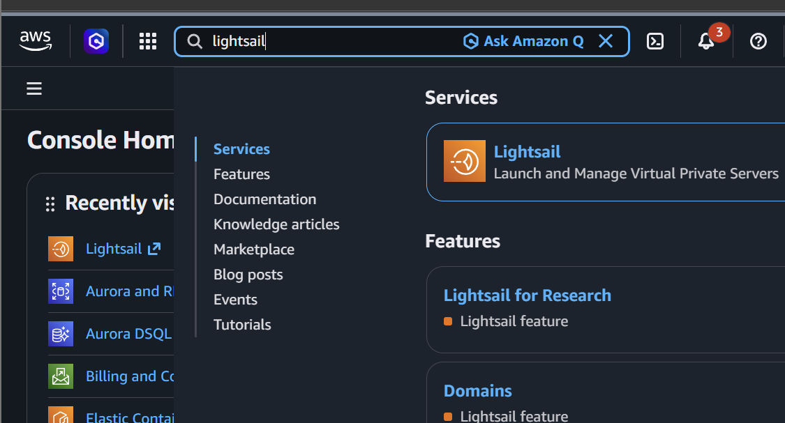

然後自己create instance啦，我係香港果陣通常會揀日本(因為玩艦娘)，新加坡台灣都冇乜所謂。不過記住用Ubuntu (其他應該都得但Ubuntu more guaranteed work):

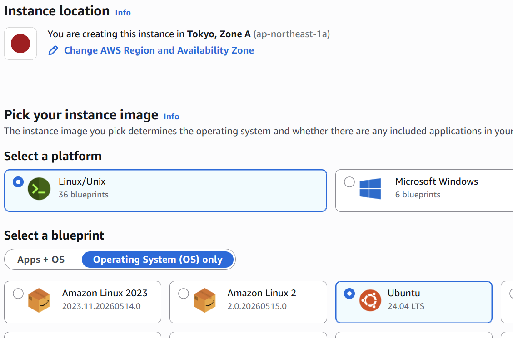

下面ssh key最好create一個, 然後download落來，唔好唔見! (唔見就要del左呢部機重新開過個，都幾煩 lol)

Instance plan 揀最平就得, network type我建議dual stack, 好似ipv6有時有d問題。然後就可以直接create instance了

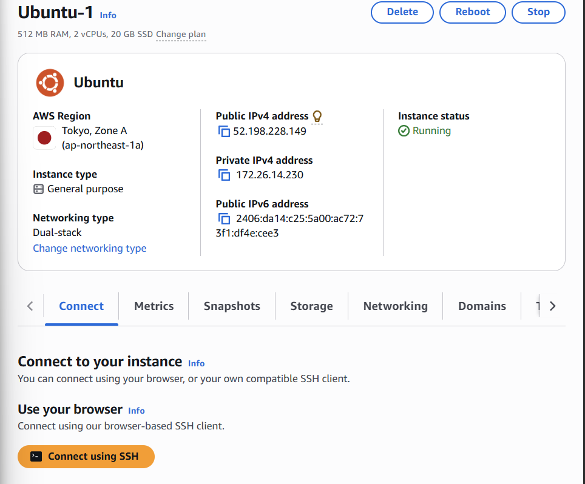

恭喜你，你終於開左你個server了！跟住禁"Connect using SSH"就連到了，呢個就係連線成功既樣:

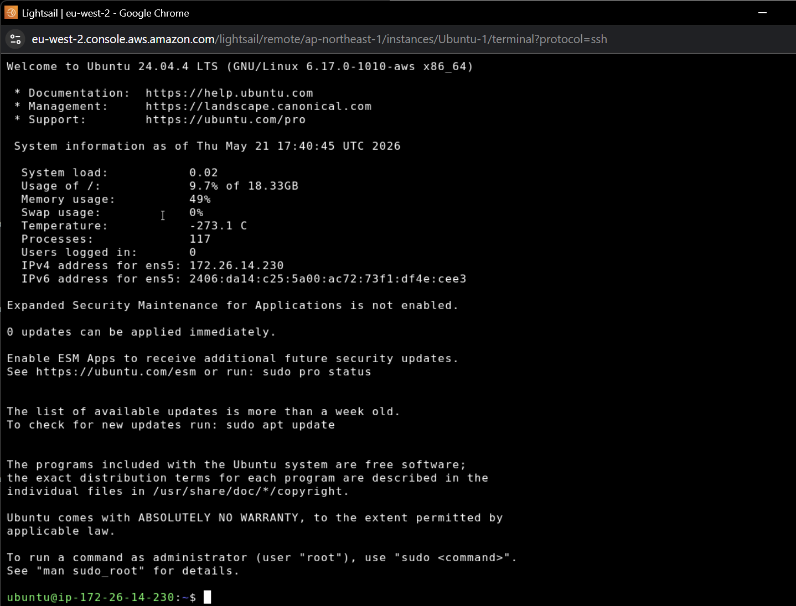

好了，有左個私家server就可以擺埋一邊了，一陣會再返黎

2. 用tailscale；tailscale好似personal plan (free) 最多六個人用，不過我地一個都夠。去 https://login.tailscale.com/ ，我自己就用google account，禁幾個制就會入去呢版：

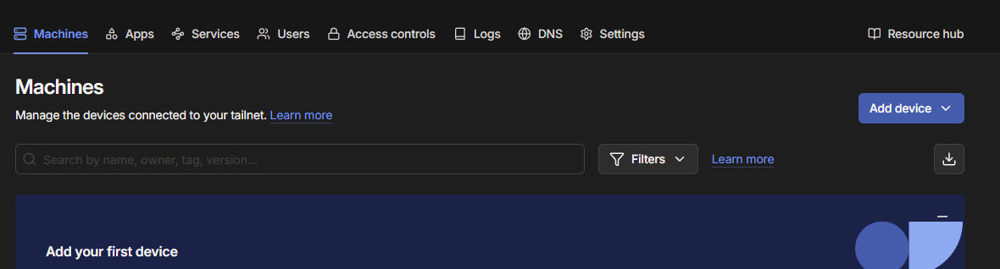

Click "Add device" -> "Linux server"

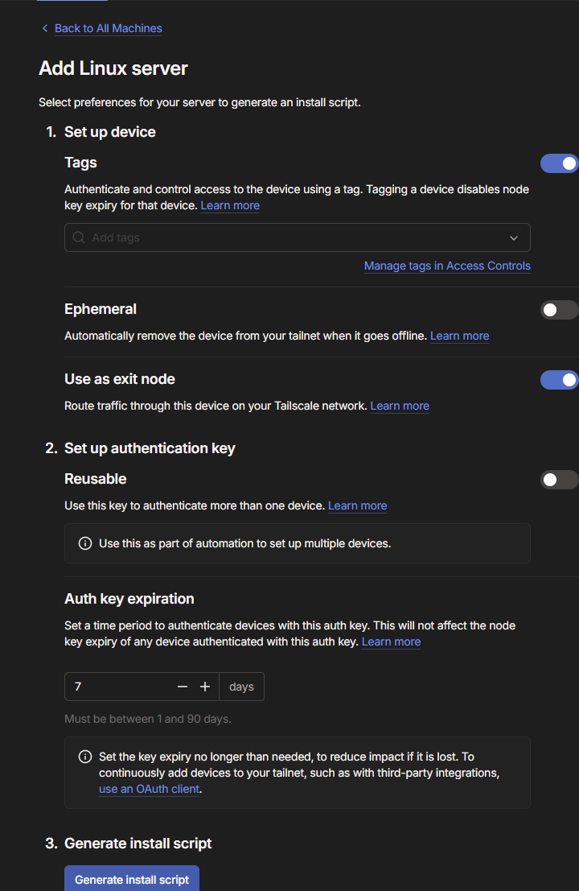

呢度記得 1. 開tag - 是但入d野就得。呢步主要目的係防止部機expire，到時要再login又煩多轉； 2. 開"Use as exit note" - 最重要的功能, 呢個就係話我地可以用呢部機作為跳板連去其他地方; 3. "Generate install script"

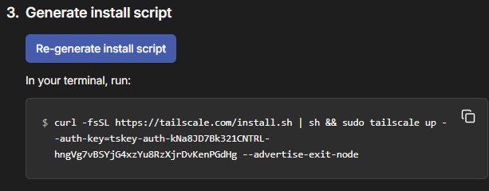

將下面段野直接copy入去頭先server果度:

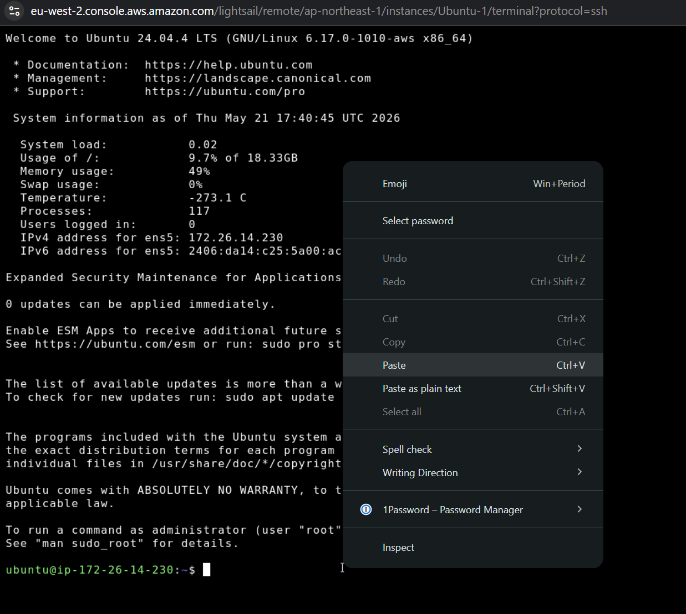

然後入呢段:

```
echo 'net.ipv4.ip_forward = 1' | sudo tee -a /etc/sysctl.d/99-tailscale.conf
echo 'net.ipv6.conf.all.forwarding = 1' | sudo tee -a /etc/sysctl.d/99-tailscale.conf
sudo sysctl -p /etc/sysctl.d/99-tailscale.conf
```

最後

```
sudo tailscale up
```

咁你個日本server出口就setup完成！呢個時候你應該可以係度check佢有冇記錄到tailscale上面:

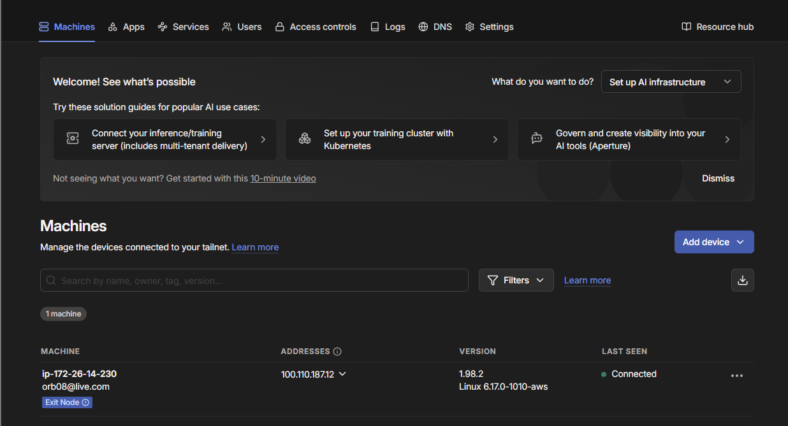

最重要見到佢左下角有個 Exit Node (!) 的模樣，然後我地要做最後一件事，要讓tailscale接受佢可以做exit node。按右邊 ... -> Edit route settings... :

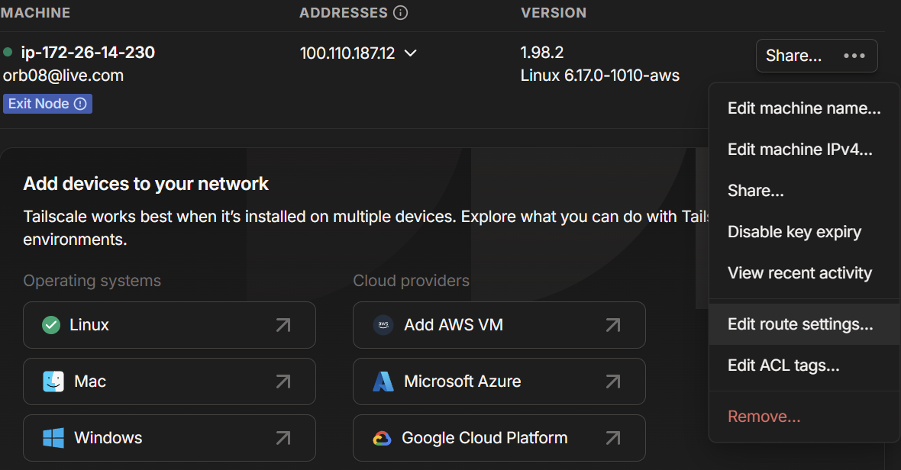

Use as exit node -> Save:

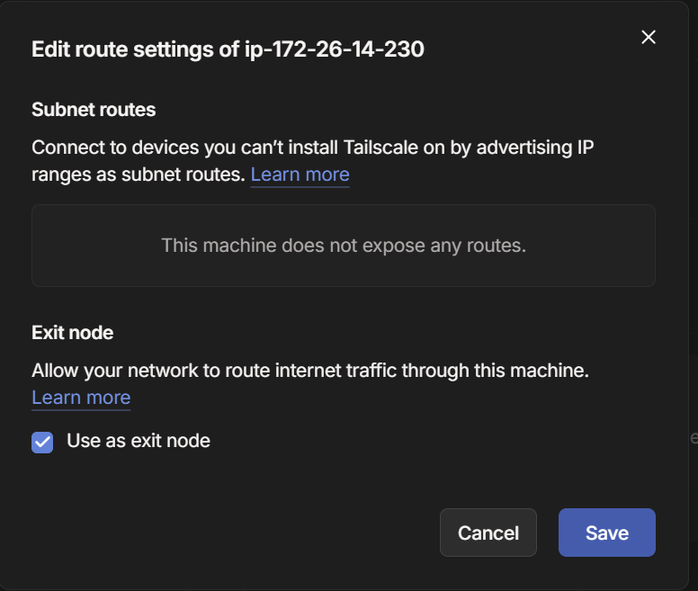

現在最麻煩的技術性工作全部搞掂，你已擁有一個真正的私人VPN，除了amazon沒任何人知道你的存在！

最後只需要按照返 tailscale 教你的方法, 裝你部windows / android手機 / ios 就得。全部都教就太論盡，呢部份自己睇(或者叫AI睇完教你)啦: https://tailscale.com/docs/install

裝完, 只要你叫你部電腦的tailscale用呢個server做exit node, 你就已經係網絡上的日本人！

---

## 申請account

唔使我教啦掛。。。自己去 https://claude.ai 自己用外國電話+外國卡申請啦。。。


